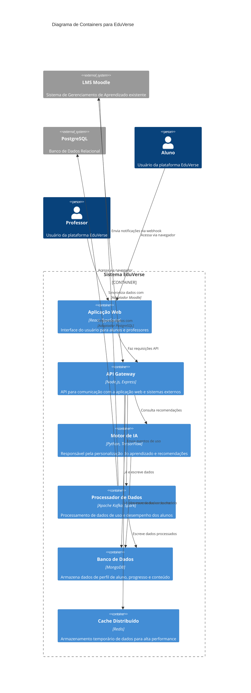

# EduVerse - Arquitetura do Sistema

## Visão Executiva do Sistema

O EduVerse é uma plataforma de aprendizado adaptativo que utiliza inteligência artificial e análise de dados para personalizar a experiência educacional. Seu objetivo é modernizar o processo de aprendizado de instituições de ensino, integrando-se com seus sistemas LMS existentes (como o Moodle) sem substituí-los. A plataforma identifica lacunas de conhecimento e recomenda conteúdos personalizados através de trilhas de aprendizado, avaliações dinâmicas e feedback instantâneo. Na Fase 4, o sistema está em um estado de maturidade arquitetural, com decisões bem fundamentadas para escalabilidade, resiliência e manutenibilidade, conforme detalhado nos documentos anexos.

## Diagrama C4 de Containers (Mermaid)

## Documentação Arquitetural

### Architecture Decision Records (ADRs)

*   [ADR 0001 - Estratégia de Nuvem e Escalabilidade](./docs/adrs/0001-estrategia-nuvem.md)
*   [ADR 0002 - Padrões de Resiliência](./docs/adrs/0002-padrao-resiliencia.md)
*   [ADR 0003 - Modelo de Comunicação](./docs/adrs/0003-modelo-comunicacao.md)

### Software Architecture Document (SAD)

*   [SAD - Fase 4](./docs/sad/sad-fase4.md)

